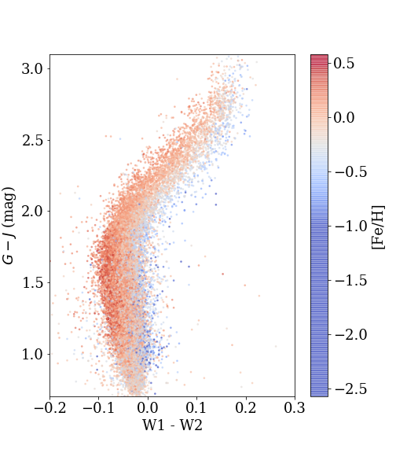

# ingot
*Stellar [Fe/H] using Wise + Gaia data*

This is a simple demonstration using machine learning (K Nearest Neighbors) to estimate the [Fe/H] value of main sequence stars giving their Gaia + infrared colors. YMMV, but please let me know if it's useful or interesting to you!

## Acknowledgements
KNN model guidance from @jakevdp. Gaia+WISE queries generated with @tzdwi. APOGEE data info from @jsobeck. Original idea generated with @sjschmidt.

This project was developed in part at the [2018 Gaia Sprint](http://gaia.lol/2018SEA.html),
hosted by the [eScience](http://escience.washington.edu) and [DIRAC](https://dirac.astro.washington.edu) Institutes at the University of Washington, Seattle, and in coordination with the 2018 NYC Gaia Sprint, hosted by the Center for Computational Astrophysics of the Flatiron Institute in New York City.

[APOGEE SDSS DR14 data](http://www.sdss.org/dr14/irspec/spectro_data/).

[AllWISE data](http://wise2.ipac.caltech.edu/docs/release/allwise/)

[Gaia DR2 data](https://www.cosmos.esa.int/gaia)
